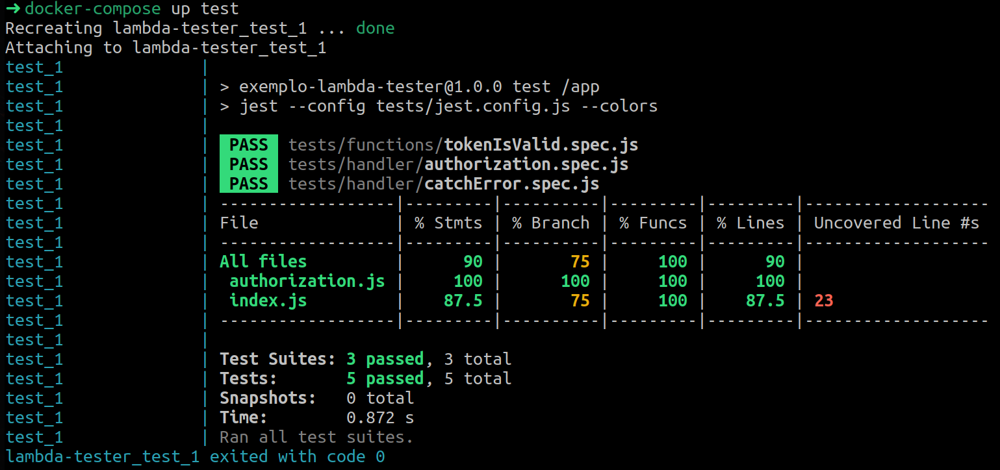

<div align="center">
  <h1>Teste unitário em aplicação Serverless</h1>
  <b><i>Deixe uma star ⭐ no repositório, isso me incentiva a criar conteúdo de qualidade de software 100% gratuito</i></b>
  <br>
  <h4><i>Esse repositório exemplifica como realizar teste unitário de aplicação Serverless de forma a validar o seu comportamento a partir dos eventos enviados e garantir que todos os componentes estão bem integrados.</i></h4>
</div>
<br>

Quando criamos funções lambda precisamos garantir o comportamento de todos os itens de maneira integrada, e isso comumente ocorre subindo a aplicação e realizando os testes manuais, enquanto os métodos que são consumidos pela função lambda são validados unitariamente.

Nesse cenário podemos garantir que o método que identifica se determinado token é valido está comportando da maneira esperada ou não, porém não temos a garantia de que ele está funcionando corretamente de maneira integrada à função lambda, barrando acessos com token inválido e permitindo apenas os acessos com o token esperado.

E é por isso que foi criado esse repositório, com o propósito de demonstrar que é sim possível validar uma função lambda totalmente integrada na camada de testes unitários, identificando comportamentos que normalmente seriam pegos apenas no teste manual. E com esse teste automatizado temos a vantagem de executar o mesmo de forma recorrente em pipeline a cada alteração.

Uma alta cobertura de cenários de funções lambda (e consequentemente alta cobertura de código) é possível.

## Como estudar esse exemplo

O exemplo principal é a demonstração da biblioteca [lambda-tester](https://www.npmjs.com/package/lambda-tester), que é utilizado nos arquivos que estão dentro do diretório [./tests/handler](./tests/handler).

Recomendo você acessar o diretório [./src](./src), estudar os 2 arquivos presentes no mesmo e em seguida executar a aplicação localmente (ler a seção [Aplicação](#aplicação) mais abaixo) para entender o comportamento da função lambda criada.

Em seguida execute os testes (ler a seção [Testes](#testes) mais abaixo) e estude os testes implementados.

### **Dica de amigo**

Todos os arquivos em _/src_ e _/tests_ possuem comentários no topo para auxiliar no entendimento do código, mesmo que não possua familiaridade com função lambda não deixe de acessá-los e ler.

Espero que te auxilie :D

## Pré-requisitos

É preciso ter os seguintes programas instalados para executar os testes e a aplicação:
- [Docker](https://docs.docker.com/get-docker/)
- [Docker-compose](https://docs.docker.com/compose/install/)

## Testes

Os testes unitários que utilizam a biblioteca [lambda-tester](https://www.npmjs.com/package/lambda-tester) estão no diretório [./tests/handler](./tests/handler).

Os testes estão divididos em 3 arquivos e validam os seguintes cenários:
- **[tests/functions/tokenIsValid.spec.js](tests/functions/tokenIsValid.spec.js) -** Teste unitário do método `tokenIsValid` (em [./src/authorization.js](./src/authorization.js)).
- **[tests/handler/catchError.spec.js](tests/handler/catchError.spec.js) -** Teste unitário da função lambda (em [./src/index.js](./src/index.js)) com a biblioteca _lambda-tester_ validando cenário de exceção.
- **[tests/handler/authorization.spec.js](tests/handler/authorization.spec.js) -** Teste unitário da função lambda (em [./src/index.js](./src/index.js)) com a biblioteca _lambda-tester_ validando a integração da função lambda com o método _tokenIsValid_.

Para rodar os testes execute o seguinte comando no terminal:

```sh
docker-compose up test
```

Ou, caso prefira, acesse a pipeline para ver o resultado dos testes: https://github.com/PauloGoncalvesBH/lambda-unit-test/actions

### Resultado do teste



A linha 23 é o cenário de execução da função lambda estando autenticado. Essa linha não foi coberta devido de que o propósito desse exemplo era demonstrar o uso da biblioteca `lambda-tester`.

## Aplicação

A aplicação está no diretório [./src](./src), tendo como ponto de entrada o arquivo [./src/index.js](./src/index.js), e com a configuração do lambda no arquivo [serverless.yml](serverless.yml).

Para iniciar a aplicação localmente execute o seguinte comando:

```sh
docker-compose up start-serverless
```

E em seguida, no browser, acesse a URL http://localhost:3000/?token=auth-password.

Para simular o comportamento de `Acesso não autorizado` acesse o browser com valor diferente em `token` ou sem o mesmo, como:
- http://localhost:3000/?token=INVALIDO
- http://localhost:3000

## Materiais de referência

- [Biblioteca NPM 'lambda-tester'](https://www.npmjs.com/package/lambda-tester)
- [Texto 'Abordagem de testes' da Samanta Cicilia](https://medium.com/assertqualityassurance/abordagem-de-testes-212b6238f0c3) (_~~Pirâmide de testes é o mito da área de QA~~_)
- [Documentação do plugin 'serverless-offline'](https://www.serverless.com/plugins/serverless-offline)

---

[LICENSE GNU General Public License v3.0](./LICENSE)
